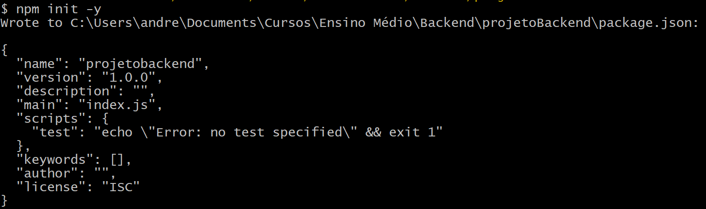

# 1º Passo: Criar pasta e organizar estrutura do projeto

* Gerenciar projeto com gitBash
* Documentar passos e comandos
* Convenções de commit

#### Criar pasta para a aplicação
```
mkdir projetoBackend
```

#### Acessar pasta
```
cd projetoBackend
```

#### Criar arquivo para documentar projeto
```
touch readme.md
```
* Arquivos com extensão .md, significam markdown, de marcação de texto. A ideia é marcar um texto informando o que é importante, o que é um tópico, o que são links e imagens, sem a necessidade de utilizar marcações mais complexas, como o HTML.

* Utilizar este arquivo para descrever as ações executadas, de forma que facilite o entendimento

#### Iniciar o gerenciador de pacotes Node
```
npm init -y
```
* Deverá ser criado um arquivo package.json na raíz do projeto

* Imagem do resultado do comando no terminal



#### Instalar os pacotes
```
npm i express nodemon dotenv
```
* express: framework web para construção da infraestrutura da API;
* nodemon: monitora as mudanças nos arquivos do projeto e reinicia automaticamente o servidor Node;
* dotenv: gerencia as variáveis de ambiente dentro do projeto;

#### Criar arquivo .gitignore
```
nano .gitignore
```
* Com o comando nano, podemos criar e editar um arquivo pelo terminal
* Ctrl + o: Salvar o arquivo
* Ctrl + x: Fechar o arquivo
* Este arquivo é utilizado para ignorar o envio de pastas e arquivos pro gitHub


#### Adicionar no arquivo .gitignore o nome da pasta criada após a instalação dos pacotes
```
node_modules
```
* Esta pasta node_modules não precisamos enviar pro gitHub, pois pode ser recriada com o comando 'npm install'

#### Criar estrutura de arquivos e pastas
```
mkdir src
```

#### Criar arquivos dentro da pasta src
```
touch src/server.js & src/app.js
```

#### Criar pastas dentro da pasta src
```
mkdir src/config & src/controllers &src/routes & 
```