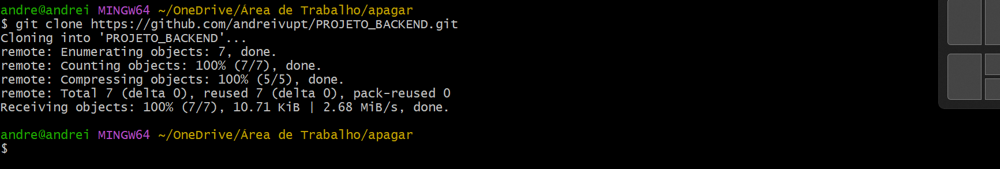
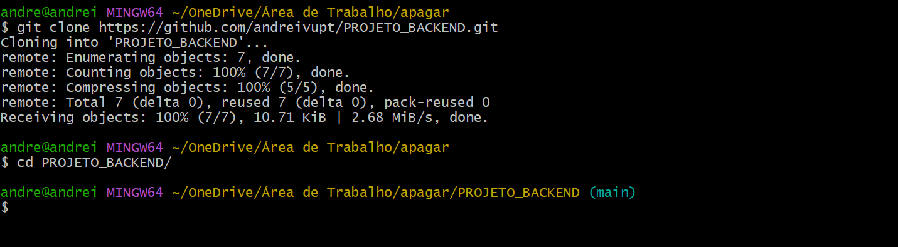

# 5º Passo: Criar controllers para gerenciar as requisições das rotas

* Copiar url do repositório no gitHub
* Clonar repositório no computador com o gitBash
* Abrir o projeto no VSCode

<hr>

#### Clonar o repositório na sua máquina

* Abrir o gitBash em um local do computador
* Digitar o comando 'git clone' junto com a URL do seu repositório

```
git clone URL_REPOSITORIO
```



#### Acessar pasta
* Digitar o comando 'cd' e o nome do seu repositório
* cd (change directory): acessar outra pasta
```
cd NOME_REPOSITORIO
```



#### Reinstalar os pacotes da aplicação
```
npm i
```
* Este comando irá recriar a pasta node_modules no projeto

#### Recriar arquivo .env
* Definir as variáveis no arquivo .env a partir das chaves definidas no arquivo .env.example

#### Criar pasta 'controllers' dentro da pasta 'src'
```
mkdir src/controllers
```
#### Criar arquivo 'crudController.js' na pasta 'controllers'
```
touch src/controllers/crudController.js
```
#### Colar os códigos no arquivo crudController.js
```
function listarDados(request, response) {
    response.send('Retorno de lista de informação do Banco de dados');
}

function gravarDados(request, response) {
    response.send('Método utilizado para salvar informações!');
}

function atualizarDados(request, response) {
    response.send('Método utilizado para editar informações!');
}

function deletarDados(request, response) {
    response.send('Método utilizado para deletar informações!');
}

module.exports = {
    listarDados,
    gravarDados, 
    atualizarDados, 
    deletarDados
}
```

#### Alterar o arquivo 'rotas.js'
```
// Importar pacote do express
const { Router } = require('express');
// Instanciar o Router na variavel router
const router = Router();
// Importar funções do controller para a rota acessar as funções
const { 
    listarDados,
    gravarDados,
    atualizarDados,
    deletarDados
 } = require('../controllers/crudController');

router.get('/listar', listarDados);

router.post('/gravar', gravarDados);

router.put('/atualizar/:id', atualizarDados);

router.delete('/deletar/:id', deletarDados);

module.exports = router;
```

## TAREFA
- Rodar o camando 'npm start' para subir o servidor
- Validar que o servidor continua rodando com últimas alterações
- Abrir o insomnia 
- Testar as 4 requisições para os métodos GET, POST, PUT e DELETE e validar os conteúdos de cada rota retornados pelas funções do 'crudController'

## Conclusão do Passo 5
#### URL do repositório com:
 * Estrutura do projeto 
 * Arquivo readme de documentação dos passos realizados
 * Configuração 
 * Retorno de teste da API
 * Arquivo de rotas com os métodos [GET, POST, PUT, DELETE]
 * Arquivo com as funções de controller
 * Imagem de cada método testado no Insomnia dentro do arquivo readme, conforme exibido na conclusão do passo 4

#### Enviar a URL na tarefa do teams
 * Tarefa 5 - Criando controllers da API